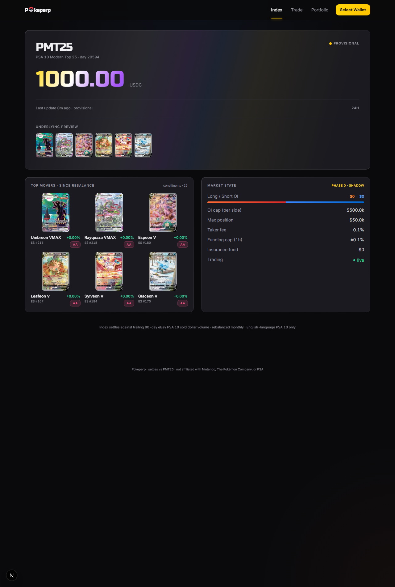
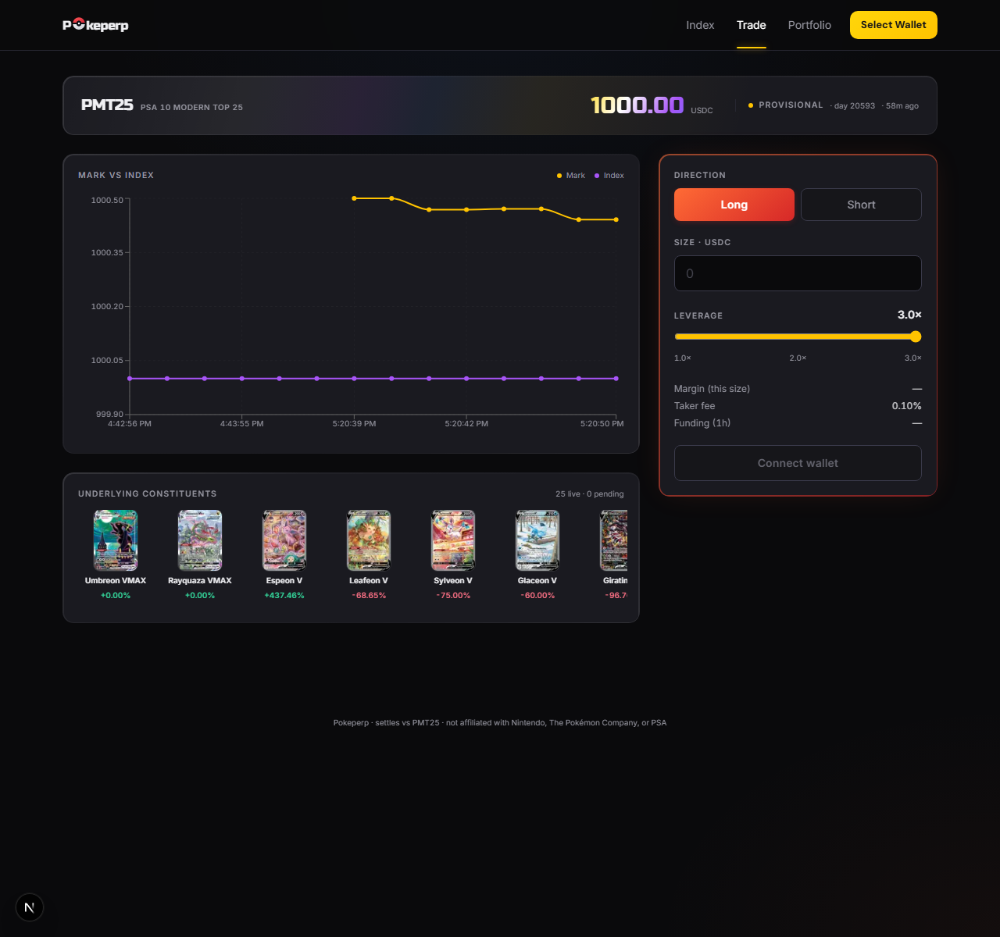

# Pokeperp

A Solana perpetual futures DEX settling against the **PSA 10 Modern Top 25** Pokemon card index (PMT25) — the 25 most-traded modern-era PSA 10 graded cards by trailing 90-day eBay sold dollar volume.





> Card art shown is loaded at runtime from the [pokemontcg.io](https://pokemontcg.io) CDN — none of it is bundled or checked into this repo. Pokeperp is not affiliated with Nintendo, The Pokémon Company, or PSA.

## Status

Working v0.2 end-to-end on localnet. Both on-chain programs are implemented and verified; off-chain services run; the dashboard renders live on-chain state and the test wallet can open / modify / close positions through a real Anchor flow.

**Implemented**

- **Oracle program** (13/13 instructions): config + publisher onboarding, 25-slot constituent registry with chunked rebalance updates, daily push submissions with on-chain median aggregation + provisional/final lifecycle, challenge open/resolve, emergency pause.
- **Perp engine program** (12/12 instructions): isolated-margin positions, oracle-anchored vAMM mark price (`index × (1 + slippage_factor × imbalance)`), per-trade mark-TWAP EMA on open / close / modify, insurance-mediated PnL settlement on close, per-position funding settlement on close + liquidate + modify (settles against pre-modify size, re-snapshots, then resizes), liquidation with penalty split, auto-deleverage path, taker fees to insurance vault.
- **Publisher binary** (`services/publisher/`): standalone Rust service. Reads the on-chain registry, computes prices via either a deterministic drift path (for localnet/staging) or the real eBay Browse source with the methodology pipeline (PSA 10 regex + qualifier rejection, English-only CJK filter, variant matching, multi-window fallback, trimmed mean), then submits a signed `PriceUpdate` to the oracle. Real merkle root over selected leaves.
- **Dashboard** (`services/dashboard/`): Next.js 15 / App Router. Pokemon-themed visual design — live card art from the pokemontcg.io CDN keyed off the on-chain `set_code` + `collector_number`, Pokeball-glyph wordmark in Russo One, animated foil gradient on the index value, Pokemon-type accent palette (fire = long, water = short, electric = highlights, psychic/dragon/grass for variant badges), holographic shimmer on card tiles. Pages: `/` (PMT25 hero + Top Movers grid + Market State with Long/Short OI proportional bar), `/trade` (slim index ticker + Mark-vs-Index chart + scrolling constituent strip + trade panel with leverage slider), `/portfolio` (open positions with type-stripe accents + close history with realized P&L column).
- **Indexer** (`services/indexer/`): subscribes to IndexState + Market account changes and polls position closures every 5 seconds. On each detected close, fetches the `close_position` tx and parses pre/post token balances to derive realized PnL = `trader_usdc_delta − margin_vault_pre`. Writes JSONL to `services/indexer/data/`; the dashboard reads via Next.js API routes.
- **Localnet seed**: `init-localnet.ts` seeds the full 25-constituent PMT25 inception list (verified prices for the 17 cards in [docs/inception-candidates.md](docs/inception-candidates.md) §2 plus best-estimate prices for the 6 unverified holdouts plus 2 Trainer Gallery / Shiny Vault fillers). `seed-index.ts` submits matching prices so the dashboard reads $1000.00 with 0% drift across all 25 cards on a fresh bring-up.

**v0.3 known gaps** (documented in code)

- `auto_deleverage` has no on-chain ranking — caller asserts the position is most profitable.
- `liquidate` funding affects the trigger but not the cash distribution.
- `close_position` doesn't charge a close-side taker fee yet (only open is charged).
- Insurance accounting nit: `open_position` taker fee bypasses `total_deposited`.
- Taker fee split: 100% to insurance currently; spec calls for 90% protocol / 10% insurance.
- Open/resolve challenge skip bond escrow + slashing.
- Publisher: real eBay Browse sold-items access needs Marketplace Insights partner approval; Card-Codex aggregate fallback not yet wired (data shape doesn't fit `PriceSource`).

## Read order for new contributors

1. [docs/methodology.md](docs/methodology.md) — what the index *is*, how constituents are picked, edge cases.
2. [docs/oracle.md](docs/oracle.md) — federated publisher design, daily push cadence, dispute mechanism.
3. [docs/perp-engine.md](docs/perp-engine.md) — oracle-anchored vAMM, margin/liquidation, funding, circuit breakers.
4. [docs/publisher.md](docs/publisher.md) — off-chain publisher design.
5. [docs/dashboard.md](docs/dashboard.md) — dashboard architecture.
6. [docs/inception-candidates.md](docs/inception-candidates.md) — verified candidate list and methodology validation against real data.

## Repo layout

```
pokeperp/
├── Anchor.toml             Anchor workspace
├── Cargo.toml              Rust workspace root (programs only)
├── docs/                   Design specs (read these first)
├── programs/
│   ├── oracle/             Publisher submissions, registry, index aggregation, challenges
│   └── perp-engine/        Market state, positions, funding, liquidation, insurance
├── services/
│   ├── publisher/          Standalone Rust publisher binary
│   ├── indexer/            JSONL on-chain event tap (Node + tsx)
│   └── dashboard/          Next.js 15 trader dashboard
├── tests/                  TypeScript integration tests
└── migrations/             Deploy script
```

## Quickstart (localnet)

The dev stack requires a side-installed Solana 1.18 for the validator (Solana 3.1.15's `solana-test-validator` has a Windows-only `unarchive` bug). Build with the default-PATH `cargo-build-sbf` (3.1.15) but deploy with 1.18 binaries.

```sh
# 1. Validator (separate terminal)
D:/solana-1.18/solana-release/bin/solana-test-validator \
  --ledger D:/sv-118 --bind-address 127.0.0.1 --rpc-port 8899

# 2. Build + deploy
anchor build
solana program deploy \
  --keypair ~/.config/solana/id.json --url http://127.0.0.1:8899 \
  --program-id target/deploy/oracle-keypair.json target/deploy/oracle.so
solana program deploy \
  --keypair ~/.config/solana/id.json --url http://127.0.0.1:8899 \
  --program-id target/deploy/perp_engine-keypair.json target/deploy/perp_engine.so

# 3. Initialize on-chain state (Config, Registry + 25 PMT25 constituents, InsuranceFund, Market)
cd services/dashboard
npx tsx scripts/init-localnet.ts

# 4. Seed an IndexState (register a publisher, submit 25 matching prices, aggregate)
npx tsx scripts/seed-index.ts

# 5. Run the publisher (drift mode — synthetic prices from on-chain base prices)
cd ../publisher
cargo run -- --config examples/publisher.localnet.toml run --dry-run

# 6. Indexer (separate terminal)
cd ../indexer && npm run start

# 7. Dashboard
cd ../dashboard && npm run dev   # → http://localhost:3000
```

Trade lifecycle scripts (run after the dashboard stack is up):

- `services/dashboard/scripts/test-trade.ts` — open → add_margin → withdraw_margin → close. Default version pauses 7s before close so the indexer's 5s poll catches the open. Set `FAST_CLOSE=1` to skip.
- `services/dashboard/scripts/test-modify.ts` — open → modify_position (+400) → modify_position (-300) → close. Prints size + OI + cumulative funding snapshot + mark TWAP at each step so you can watch the v0.2 funding-settlement + TWAP wire fire on every size change.

## On-chain build / toolchain notes

- Anchor 0.31.1, Solana CLI 3.1.15 for builds (default PATH), Solana 1.18.26 for the localnet validator and `solana program deploy`.
- `ConstituentRegistry` and `Market` use `#[account(zero_copy)]` to stay under Solana's 4KB stack frame in `try_accounts`.
- `set_constituents` is split into `initialize_registry` + 25× `update_constituent` + `finalize_registry_update` to stay under the 1232-byte tx data cap. A full rebalance is 27 transactions.
- Heavy `Account<>` types are `Box<Account<>>` in any Accounts struct with multiple init accounts or large account types.
- Anchor 0.31 quirk: `mark_twap_1h` camelCases to `markTwap1H` (capital H after digit) in the runtime decoder but local-derived IDL TypeScript files may strip underscores naively to `markTwap1h` — keep the IDL `.ts` field names matching the runtime, not the JSON literal. Re-apply after every IDL regen.
- When the `.so` grows past its existing program-data account allocation, deploys fail with `account data too small for instruction`. Fix with `solana program extend <program_id> <additional_bytes>` (e.g. `100000`) before retrying.
- The on-chain `submit_price_update` window defaults to 20:00–23:59 UTC. For localnet/CI, `init-localnet.ts` widens it to the full day; production keeps the tighter window via a separate Config init path.

## Off-chain components

- **Publisher binary** (`services/publisher/`): Rust + Tokio. Config switches `[sources] primary` between `"drift"` (default, on-chain base_price + ±2% day-keyed perturbation, no external HTTP) and `"ebay_browse"` (OAuth2 client_credentials, paginated `item_summary/search?filter=soldItems`, methodology pipeline, real merkle root). See [docs/publisher.md](docs/publisher.md).
- **Trader dashboard** (`services/dashboard/`): App Router + Tailwind + Solana wallet adapter. `useTradeActions` builds Anchor methods calls for open / modify / add-margin / withdraw-margin / close. Visual design system: `lib/cards.ts` maps internal `set_code` (e.g. `"ES"`) to pokemontcg.io set IDs (e.g. `"swsh7"`) and resolves to `https://images.pokemontcg.io/{set_id}/{number}.png` for card art — 16 sets currently mapped, covering the inception candidate list. Reusable components: `Pokeball`, `PokeperpLogo`, `CardImage` (with shimmer loader + graceful fallback for unmapped sets), `TypeBadge` (18-type pill palette). All Pokemon TCG card images are loaded at runtime from a third-party CDN — none are bundled or checked into the repo. See [docs/dashboard.md](docs/dashboard.md).
- **Indexer** (`services/indexer/`): `tsx src/index.ts`. Captures initial state on startup then streams account changes; detects position closures by diffing the previous poll's known-position set.

## License

TBD.
