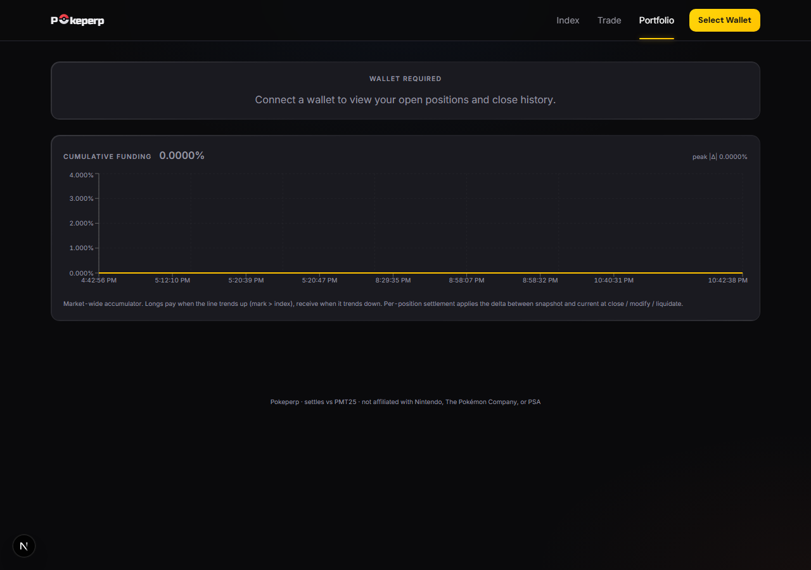

# Pokeperp

A Solana perpetual futures DEX settling against the **PSA 10 Modern Top 25** Pokemon card index (PMT25) — the 25 most-traded modern-era PSA 10 graded cards by trailing 90-day eBay sold dollar volume.




> Card art shown is loaded at runtime from the [pokemontcg.io](https://pokemontcg.io) CDN — none of it is bundled or checked into this repo. Pokeperp is not affiliated with Nintendo, The Pokémon Company, or PSA.

## Status

**Live on Solana mainnet-beta** as of **2026-05-28**, and on devnet in parallel as a staging environment. Both on-chain programs are deployed and upgraded with the v0.9 security fixes; the off-chain stack (publisher crank, keeper, monitor, indexer, scraper) runs on Railway; the dashboard is live at **[pokeperp.com](https://pokeperp.com)**. **120+ tests passing across the workspace** (22 oracle integration + 27 perp-engine integration including the v0.9 update_risk_params block + 6 oracle v0.9 unit + 5 funding-math unit + 11 mark-price/EMA unit + 52 publisher unit; 1 perp-engine test self-skips when the liquidation-test EMA hasn't converged).

**Trading is open at 5× max leverage** (IM 2000 bps / MM 1000 bps, 50k USDC per-trader cap, 500k OI/side) — set via the v0.9 `update_risk_params` admin setter, so leverage and caps can now be tuned à-la-carte without `set_phase` bundles. The insurance fund scales toward its $25k floor as fees and buybacks compound; per-trader and per-side caps stay conservative until it does.

**$POKE token** launched on 2026-05-28 via Meteora DBC → graduated to DAMM v2 at the 85 SOL threshold. CA: `pokeHAfu5hjQbKaHfQJns3BUVRYMLvPfKJHKx9sBBtX`. **5% trade tax** (80% LP fees to the creator wallet / 20% Meteora protocol). LP fee revenue funds the **buyback flywheel** — automated dev buybacks routed back into the chart, with the bought supply held in the dev buyback wallet and tracked publicly at [fomo.family/profile/PokePerpss](https://fomo.family/profile/PokePerpss). 10% of supply is locked-vested in the DBC config — 5M $POKE released every 15 days over 300 days, never sold by the team. An X-style **on-site updates feed** lives at [`/updates`](https://pokeperp.com/updates) so announcements can't be wiped by an external platform.

**Off-chain index pipeline.** A standalone **publisher crank** runs as an always-on Railway worker (`publisher-crank`): it polls every 60s and, whenever the previous UTC day hasn't been submitted + aggregated yet, scrapes real eBay-derived PSA 10 prices (via the Oxylabs scraper service), submits them, and calls `aggregate_day` — so the index self-updates within ~1 min of each midnight-UTC rollover and a failed cycle retries on the next tick. The index moves **once per UTC day** by design: that's the resolution of the underlying sold-price data, so the index is a slow, hard-to-manipulate settlement anchor while the vAMM mark moves continuously on trader flow and funding reconciles the spread (see [docs/perp-engine.md](docs/perp-engine.md) §4). A second Railway worker, **`keeper`** (`services/keeper/`), runs the market mechanics: every 60s it calls `settle_funding` (gated so funding accrues at most hourly) and scans every open position, liquidating any whose equity has fallen below maintenance margin. Between the index crank and the keeper the market self-maintains — index, funding, and liquidations all advance with no manual cranking.

**Operational hardening.** On *devnet* the admin authority on both programs has been migrated to a **2-of-3 Squads V4 multisig** via the v0.8 two-step transfer flow — `Config.admin` and `Market.admin` point at the Squad vault PDA. On *mainnet* the same migration is staged but deferred: admin is currently the deploy wallet with the 2-of-3 mainnet signer keys pre-generated for the handover. A third Railway worker, **`monitor`** (`services/monitor/`), polls protocol *outcomes* every 2 min — oracle freshness, funding advancement, bad debt, insurance floor, indexer `/health`, and keeper SOL balance — and fires Telegram alerts on OK↔BAD transitions, so it catches "service running but not doing its job," not just process death. The dashboard routes all RPC through a server-side proxy (`/api/rpc`) so the paid Helius endpoint key never reaches the browser, and the live-data hooks now poll over that same proxy (no WebSocket dependency on flaky keyless public endpoints). Public protocol docs at **`/docs`**, X-style updates at **`/updates`**. The mainnet bring-up sequence, signer composition, and incident runbook are in [docs/mainnet-runbook.md](docs/mainnet-runbook.md) (internal) with a secrets/key inventory in [docs/secrets.md](docs/secrets.md).

**Implemented**

- **Oracle program** (17/17 instructions): config + publisher onboarding, 25-slot constituent registry with chunked rebalance updates, daily push submissions with on-chain median aggregation + provisional/final lifecycle, **v0.9 permissionless `resolve_challenge`** — the admin-attested slash tier is gone; instead the ix reads the publisher's submitted price for the challenged constituent and the protocol's `IndexState.aggregated_prices`, computes `|publisher_price − aggregated_price| / aggregated_price` in basis points, and maps to a tier per spec §7 (<2% dismiss, 2–5% 10% slash, 5–10% 50% slash + Suspended, ≥10% 100% slash + Removed) with no human judgment in the loop. Zero aggregated price (constituent went stale that day) → dismissal. Cash flows unchanged (success: 50/50 challenger/treasury; failure: 50/50 publisher-refill/treasury). Real per-challenge bond escrow + slash distribution still wired through the existing dual-vault flow. `set_protocol_treasury` admin setter that wires the perp-engine treasury vault into oracle Config. **v0.9 `slash_for_liveness`** — permissionless crank that reads `publisher.last_submitted_day` vs the current Unix day and applies the §7 absence tiers (3 days → 5%, 7 days → 25% + Suspended, 14 days → 100% + Removed) directly from the publisher's bond vault to the protocol treasury. Tier-applied marker on `Publisher` prevents double-slashing within the same gap; resets on the publisher's next successful submission. Emergency pause, **v0.8 two-step admin transfer** (`propose_admin_transfer` + `accept_admin_transfer`) for migrating Config.admin to a Squads multisig vault PDA without leaving a single-key window.
- **Perp engine program** (17/17 instructions): isolated-margin positions, oracle-anchored vAMM mark price (`index × (1 + slippage_factor × imbalance)`), per-trade mark-TWAP EMA on open / close / modify, insurance-mediated PnL settlement on close with **v0.6 self-ADL fallback** (insurance shortfall haircuts the closing trader + emits `InsuranceShortfall` event instead of reverting), per-position funding settlement on close + liquidate (now with actual cash flow through the insurance vault, not just the equity-check gate) + modify (settles against pre-modify size, re-snapshots, then resizes), open + close taker fees split 90% to protocol Treasury + 10% to InsuranceFund per spec §9, admin-gated `withdraw_treasury` for protocol revenue pull, liquidation with penalty split (1/3 liquidator, 2/3 insurance), **v0.7 deterministic `auto_deleverage`** — caller passes exactly `same_side_count − 1` witnesses (per-side open-position counts tracked in `Market` state and bounded by `max_positions_per_side` = 25 for current tx-size limits), each witness must be on the candidate's side + belong to this market + have PnL ≤ candidate's at the same index price + correspond to a distinct trader, proving the candidate is the globally-highest-PnL position on its side. ADL payout is haircut by `adl_haircut_bps` (default 5000 = 50% of positive PnL retained by insurance), with the top-up routed insurance → margin → trader so the un-paid-out haircut directly recapitalizes the fund; emits `InsuranceShortfall { kind: 3 }` when even the post-haircut topup exceeds insurance balance. **v0.8** adds public `deposit_insurance` (anyone can top up the insurance vault — required for mainnet seed) and matching `propose_admin_transfer` + `accept_admin_transfer` for safe Squads multisig handover on Market.admin.
- **Publisher binary** (`services/publisher/`): standalone Rust service. Reads the on-chain registry, computes prices via a deterministic drift path (for localnet/staging), the real eBay Browse source, or the Oxylabs-backed **scraper** source (`services/scraper/`, what the live devnet deployment uses) — all feeding the same methodology pipeline (PSA 10 regex + qualifier rejection, English-only CJK filter, variant matching, multi-window fallback, trimmed mean), with a Card-Codex aggregate-price fallback when listings are insufficient. Persistent `<config>.state.json` sidecar tracks per-constituent `last_fresh_day` for the stale-decay fallback. Real merkle root over selected leaves. Subcommands: `run` (one-shot submit for `current_day−1`), **`crank --interval-secs N`** (poll loop that submits + calls `aggregate_day` whenever the day isn't already on-chain — the always-on Railway deployment; idempotent no-op otherwise), `daemon` (fixed daily schedule, submit only), and `verify --day N [--tolerance-bps M]` (re-runs a day's computation locally and compares to the on-chain submission for post-hoc audit; non-zero exit on disagreement). The signing keypair loads from the `PUBLISHER_KEYPAIR_JSON` env var (injected as a Railway secret — no key file in the image) or the config's `publisher_keypair_path` for local dev.
- **Dashboard** (`services/dashboard/`): Next.js 15 / App Router. Pokemon-themed visual design — live card art from the pokemontcg.io CDN keyed off the on-chain `set_code` + `collector_number`, Pokeball-glyph wordmark in Russo One, animated foil gradient on the index value, Pokemon-type accent palette (fire = long, water = short, electric = highlights, psychic/dragon/grass for variant badges), holographic shimmer on card tiles. Pages: `/` (PMT25 hero + Top Movers grid + Market State with Long/Short OI proportional bar), `/trade` (slim index ticker + Mark-vs-Index chart + scrolling constituent strip + trade panel with leverage slider), `/portfolio` (wallet-gated open positions with type-stripe accents + close history with realized P&L column, plus a market-wide cumulative funding chart rendered regardless of wallet state), and `/docs` (public protocol docs — index methodology, perpetuals mechanics, and oracle design — rendered from markdown in `content/docs/`). All browser RPC goes through a server-side proxy at `/api/rpc` so the paid Helius endpoint key stays server-only.
- **Indexer** (`services/indexer/`): subscribes to IndexState + Market account changes and polls position closures every 5 seconds. On each detected close, fetches the `close_position` tx and parses pre/post token balances to derive realized PnL = `trader_usdc_delta − margin_vault_pre`. Writes JSONL to `services/indexer/data/`; the dashboard reads via Next.js API routes.
- **Localnet seed**: `init-localnet.ts` seeds the full 25-constituent PMT25 inception list (verified prices for the 17 cards in [docs/inception-candidates.md](docs/inception-candidates.md) §2 plus best-estimate prices for the 6 unverified holdouts plus 2 Trainer Gallery / Shiny Vault fillers). `seed-index.ts` submits matching prices so the dashboard reads $1000.00 with 0% drift across all 25 cards on a fresh bring-up.

**Closed in v0.9**

- **`update_risk_params` instruction.** Admin-gated à-la-carte setter for `initial_margin_bps` / `maintenance_margin_bps` / `max_oi_per_side` / `max_position_per_trader` / `funding_cap_per_hour_bps` / `slippage_factor` — same validations as `initialize_market` (IM > MM, MM > 0, funding cap < 100%, etc.). Lets leverage and caps be tuned without `set_phase` bundles, so phase is no longer the only knob for risk params. Used on 2026-05-29 to set 5× leverage on mainnet while *keeping* the conservative 500k OI / 50k per-trader caps (decoupled from the 5M / 250k Phase-2 bundle).
- **`modify_position` PnL/entry accounting fix (critical).** The pre-fix path updated `size` without realizing PnL or updating `entry_mark_price`, so an **increase** back-dated the added notional to the stale entry (free profit on close) and a **decrease** let a losing trader shed size without realizing the loss. Fixed: weighted-average entry on increase (mark + index) over old vs. current; realized PnL on decrease at the post-modify mark, routed through insurance exactly the way `close_position` does; IM re-checked against fresh margin *after* the PnL settlement, not before. Verified end-to-end on devnet via a 6-check regression script (`services/dashboard/scripts/validate-modify-devnet.ts`).
- **`withdraw_margin` real-equity solvency check (critical).** Previously checked only raw `post_margin ≥ IM`, ignoring unrealized PnL + funding — a losing trader could strip collateral down to the IM line while real equity sat far below it. Fixed: also requires `equity_post = post_margin + mark_PnL − funding_owed ≥ IM`, valued the same way `close_position` / `liquidate` do. `index_state` added to the accounts context. Same devnet regression covers it.
- **On-chain challenge deviation check.** `resolve_challenge` no longer takes admin-attested `(challenge_succeeded, slash_bps)`; it reads `aggregated_prices[constituent]` from `IndexState` plus the publisher's submitted price, computes deviation in bps, and maps to a slash tier deterministically. Permissionless (anyone can crank). Cash flows + bond-vault accounting unchanged from v0.5. Pure tier-mapping function `deviation_to_slash_tier` is unit-tested for all four branches.
- **Liveness slashing on absent publishers.** New permissionless `slash_for_liveness(publisher)` instruction. Reads `last_submitted_day` vs current day, applies §7 tiers (3/7/14 days → 5%/25%/100% of current bond + status transitions to Suspended/Removed at tier 2/3). `last_liveness_slash_tier` on `Publisher` enforces "no double-slashing within a tier" and resets on the next successful submission so each new absence gap can re-tier from scratch. Slashed funds route 100% to protocol treasury (no challenger to split with). Shadow + Removed publishers are exempt.

**Closed in v0.8**

- **Insurance fund can now be seeded.** New `deposit_insurance(amount)` instruction on perp-engine — anyone can deposit USDC into the insurance vault. Public (no admin gate) because donating to insurance is strictly good for the protocol and there's no withdrawal path that's exploitable. Required at mainnet launch to seed the fund with the ~25k–100k USDC backing that Phase 1 needs.
- **Two-step admin transfer on both programs.** `propose_admin_transfer(new_admin)` (called by current admin) writes `pending_admin` on Market / Config; `accept_admin_transfer()` (signed by the proposed key) commits and clears the pending slot. Lets you safely hand the protocol's admin authority to a Squads multisig vault PDA without a "transfer to typo" or "transfer to a key that can't sign" failure mode — the accept step proves the new admin can actually act before authority is committed. Adds `pending_admin: Pubkey` to both `Market` and `Config` state.

**Closed in v0.7**

- `auto_deleverage` ranking is now **deterministic** — exactly `same_side_count − 1` witnesses required, with uniqueness + side + lower-PnL all enforced on-chain. The "probabilistic ≥ 1 witness" v0.4–v0.6 proof is gone.
- `auto_deleverage` now **haircuts** the deleveraged trader's positive PnL by `adl_haircut_bps` (default 50%) and retains the haircut in the insurance fund — the missing recapitalization mechanism that the spec calls for. Negative-PnL ADL also correctly sweeps the residual loss to insurance.
- Latent v0.6 ADL bug **fixed**: prior code tried to transfer `margin + pnl` from the margin vault (which only holds `margin`), so any winning ADL candidate would have failed with `InsufficientFunds`. New flow routes the top-up through insurance → margin → trader, and the missing `insurance_vault` account was added to the `AutoDeleverage` context.
- Self-ADL insurance shortfall path covered by **real integration test** (replaces the v0.6 "event exists in IDL" placeholder): spawns 2 shorts + 1 long with depressed entry_mark, drives positive on-chain PnL of ~$1900, verifies wrong-witness rejection + topup math + haircut retention (topup strictly < gross pnl) + position closure + count decrement + insurance accounting invariant.

**v0.9 known gaps** (documented in code)

- ~~The admin-transfer ix lets you point Market.admin / Config.admin at a Squads vault PDA, but the actual Squad creation is an operational task not in this repo~~ **closed on devnet**: a 2-of-3 Squads V4 multisig is live, `Config.admin` + `Market.admin` are migrated to its vault PDA, and the create/propose/accept scripts are committed under `services/dashboard/scripts/squads/`. Signer composition, threshold rationale, and the mainnet bring-up sequence are documented in [docs/mainnet-runbook.md](docs/mainnet-runbook.md). (The same Squad PDA carries over to mainnet; only the program IDs and member keys change.)
- ~~Multi-publisher integration test for the actual challenge-slash path~~ **closed**: `tests/oracle.ts` now has "slashes a deviant publisher on a successful multi-publisher challenge" — 3 publishers, one deviant, median aggregate, permissionless resolve → 100% slash + Removed + 50/50 bond redistribution. (Slash-tier mapping also unit-tested in `v09_tests`.)
- Positive-path liveness-slash integration test requires advancing the on-chain clock past the day-threshold boundaries, which the test-validator harness doesn't support cleanly. The TS suite covers the negative paths (Shadow not eligible, no new tier when not absent); the slash math is unit-tested in Rust.
- `max_positions_per_side` is capped at 25 to keep the ADL witness list inside a single 1232-byte Solana transaction. Raising this for Phase 2+ scale requires address lookup tables (ALTs) or a versioned-transaction migration.
- Publisher: the eBay Browse sold-items *API* still needs Marketplace Insights partner approval — the live devnet crank sources real eBay-derived prices via the Oxylabs scraper (`services/scraper`) in the meantime. Card-Codex aggregate fallback wired in v0.4 with a 23-of-25 inception-card URL mapping (Shining Fates Shiny Vault uses SV-prefixed numbers that don't fit Card-Codex's collector-number URL convention — deferred).

## Read order for new contributors

1. [docs/methodology.md](docs/methodology.md) — what the index *is*, how constituents are picked, edge cases.
2. [docs/oracle.md](docs/oracle.md) — federated publisher design, daily push cadence, dispute mechanism.
3. [docs/perp-engine.md](docs/perp-engine.md) — oracle-anchored vAMM, margin/liquidation, funding, circuit breakers.
4. [docs/publisher.md](docs/publisher.md) — off-chain publisher design.
5. [docs/dashboard.md](docs/dashboard.md) — dashboard architecture.
6. [docs/inception-candidates.md](docs/inception-candidates.md) — verified candidate list and methodology validation against real data.

## Repo layout

```
pokeperp/
├── Anchor.toml             Anchor workspace
├── Cargo.toml              Rust workspace root (programs only)
├── docs/                   Design specs (read these first)
├── programs/
│   ├── oracle/             Publisher submissions, registry, index aggregation, challenges
│   └── perp-engine/        Market state, positions, funding, liquidation, insurance
├── services/
│   ├── publisher/          Standalone Rust publisher binary (run / crank / daemon / verify)
│   ├── scraper/            Oxylabs-backed eBay sold-listings proxy (Node, Dockerized for Railway)
│   ├── keeper/             Funding + liquidation crank (Node + tsx, Railway worker)
│   ├── monitor/            Protocol-health watcher + Telegram alerts (Node + tsx, Railway worker)
│   ├── indexer/            JSONL on-chain event tap (Node + tsx)
│   └── dashboard/          Next.js 15 trader dashboard (+ /docs, server-side RPC proxy)
├── tests/                  TypeScript integration tests
└── migrations/             Deploy script
```

## Quickstart (localnet)

The dev stack requires a side-installed Solana 1.18 for the validator (Solana 3.1.15's `solana-test-validator` has a Windows-only `unarchive` bug). Build with the default-PATH `cargo-build-sbf` (3.1.15) but deploy with 1.18 binaries.

```sh
# 1. Validator (separate terminal)
D:/solana-1.18/solana-release/bin/solana-test-validator \
  --ledger D:/sv-118 --bind-address 127.0.0.1 --rpc-port 8899

# 2. Build + deploy
anchor build
solana program deploy \
  --keypair ~/.config/solana/id.json --url http://127.0.0.1:8899 \
  --program-id target/deploy/oracle-keypair.json target/deploy/oracle.so
solana program deploy \
  --keypair ~/.config/solana/id.json --url http://127.0.0.1:8899 \
  --program-id target/deploy/perp_engine-keypair.json target/deploy/perp_engine.so

# 3. Initialize on-chain state (Config, Registry + 25 PMT25 constituents, InsuranceFund, Market)
cd services/dashboard
npx tsx scripts/init-localnet.ts

# 4. Seed an IndexState (register a publisher, submit 25 matching prices, aggregate)
npx tsx scripts/seed-index.ts

# 5. Run the publisher (drift mode — synthetic prices from on-chain base prices)
cd ../publisher
cargo run -- --config examples/publisher.localnet.toml run --dry-run

# 6. Indexer (separate terminal)
cd ../indexer && npm run start

# 7. Dashboard
cd ../dashboard && npm run dev   # → http://localhost:3000
```

Trade lifecycle scripts (run after the dashboard stack is up):

- `services/dashboard/scripts/test-trade.ts` — open → add_margin → withdraw_margin → close. Default version pauses 7s before close so the indexer's 5s poll catches the open. Set `FAST_CLOSE=1` to skip.
- `services/dashboard/scripts/test-modify.ts` — open → modify_position (+400) → modify_position (-300) → close. Prints size + OI + cumulative funding snapshot + mark TWAP at each step so you can watch the v0.3 funding-settlement + TWAP wire fire on every size change.

Audit:

- `cd services/publisher && cargo run -- --config examples/publisher.localnet.toml verify --day N [--tolerance-bps M]` — re-runs day N's computation locally and compares to the on-chain submission. Drift mode is deterministic so `--tolerance-bps 0` is the correct strict check; ebay_browse should tolerate a few bps to absorb sample-window churn.

Integration tests (require a fresh `--reset` validator):

```sh
ANCHOR_PROVIDER_URL=http://127.0.0.1:8899 \
ANCHOR_WALLET="$HOME/.config/solana/id.json" \
npx ts-mocha -p ./tsconfig.json -t 1000000 tests/oracle.ts
npx ts-mocha -p ./tsconfig.json -t 1000000 tests/perp-engine.ts
```

- `tests/oracle.ts` (22 tests): Config init, publisher register + bond escrow + activate-shadow-period gating, submit_price_update + duplicate rejection, registry init + update + finalize, aggregate_day all-stale path, **challenge open with bond escrow + v0.9 permissionless deviation-based resolution** (single-publisher test setup means aggregated price → 0 / dismissal; deviation tier mapping itself is unit-tested in Rust), bond redistribution on dismissal, **multi-publisher challenge-slash path** (registers 3 publishers, one deviant +50% on a constituent, re-aggregates the median, opens + permissionlessly resolves the challenge → 100% slash + status Removed + 50/50 bond redistribution with `challengerPayout` = slash share + refunded bond), **v0.9 liveness slashing rejection paths** (Shadow not eligible + no new tier when freshly submitted; IDL presence check), emergency pause, **v0.8 two-step admin transfer** (propose → accept → restore, with old-admin loses-authority assertion). Plus 6 Rust unit tests for the v0.9 tier helpers (deviation → slash tier 4 branches + days_absent → tier + tier → slash_bps).
- `tests/perp-engine.ts` (24 + 1 pending): setup (insurance + treasury + market) → open / add_margin / withdraw_margin / modify_position / close lifecycle → liquidation scaffold (mark-pressure via 10 longs at the 500k OI cap; `this.skip()` if the EMA-smoothed TWAP doesn't cross the equity-below-MM threshold — prints the actual equity vs MM numbers) → treasury withdrawal (admin + non-admin reject) → **v0.7 auto_deleverage**: opens 2 shorts to depress mark, opens a long alice whose `entry_mark < index` (positive PnL at index), rejects ADL with wrong witness count, then exercises the haircut + insurance topup path — verifies alice's payout = margin + topup, insurance `total_paid_out` advanced by topup, position closed, `long_position_count` decremented, and `topup < pnl` (proving the haircut retained funds in insurance) → **v0.8 deposit_insurance + admin transfer**: 10k USDC deposit verifies vault delta + accounting invariant, zero-amount deposit reverts, full propose → accept → restore admin-transfer cycle with stranger-can't-accept + old-admin-loses-authority assertions → end-of-suite invariants (`insurance_vault.amount == deposited − paid_out`, same for treasury).

Rust unit tests: `cargo test -p perp-engine --lib funding_tests` (5 passing) + `cd services/publisher && cargo test` (52 passing — methodology regex/filters, eBay JSON parsing, Card-Codex URL build + HTML scrape, state file round-trip, drift determinism).

## On-chain build / toolchain notes

- Anchor 0.31.1, Solana CLI 3.1.15 for builds (default PATH), Solana 1.18.26 for the localnet validator and `solana program deploy`.
- `ConstituentRegistry` and `Market` use `#[account(zero_copy)]` to stay under Solana's 4KB stack frame in `try_accounts`.
- `set_constituents` is split into `initialize_registry` + 25× `update_constituent` + `finalize_registry_update` to stay under the 1232-byte tx data cap. A full rebalance is 27 transactions.
- Heavy `Account<>` types are `Box<Account<>>` in any Accounts struct with multiple init accounts or large account types.
- Anchor 0.31 quirk: `mark_twap_1h` camelCases to `markTwap1H` (capital H after digit) in the runtime decoder but local-derived IDL TypeScript files may strip underscores naively to `markTwap1h` — keep the IDL `.ts` field names matching the runtime, not the JSON literal. Re-apply after every IDL regen.
- When the `.so` grows past its existing program-data account allocation, deploys fail with `account data too small for instruction`. Fix with `solana program extend <program_id> <additional_bytes>` (e.g. `100000`) before retrying.
- The on-chain `submit_price_update` window defaults to 20:00–23:59 UTC. For localnet/CI, `init-localnet.ts` widens it to the full day; production keeps the tighter window via a separate Config init path.

## Off-chain components

- **Publisher binary** (`services/publisher/`): Rust + Tokio. Config switches `[sources] primary` between `"drift"` (default, on-chain base_price + ±2% day-keyed perturbation, no external HTTP), `"ebay_browse"` (OAuth2 client_credentials, paginated `item_summary/search?filter=soldItems`), and `"scraper"` (HTTP GET to the `services/scraper` proxy — the devnet path). Three-tier fallback: (1) listings → trimmed mean, (2) Card-Codex aggregate price via `card-codex.com/pokemon/{era}/{set}/{slug}-{number}-{rarity}/` HTML scrape (23/25 inception cards mapped), (3) `apply_decay` against on-chain `base_price` using real `days_since_fresh` from `<config>.state.json`. The `crank` subcommand additionally calls `aggregate_day` after submitting (permissionless — the publisher keypair pays), so a single always-on process keeps the index current; deploy it with `railway up --service publisher-crank --ci` from `services/publisher/`, with the signing key set as the `PUBLISHER_KEYPAIR_JSON` secret. See [docs/publisher.md](docs/publisher.md).
- **Scraper service** (`services/scraper/`): thin Node proxy in front of the Oxylabs Web Scraper API — `GET /scrape?q=<query>` returns parsed eBay PSA 10 sold listings in the publisher's wire format, `GET /health` for the platform healthcheck. Retries transient Oxylabs failures (613 / 5xx) up to 3× with backoff so a flaky upstream call doesn't fail a constituent. Dockerized and deployed on Railway; the publisher points at it via `[sources.scraper].url` / `SCRAPER_URL`.
- **Trader dashboard** (`services/dashboard/`): App Router + Tailwind + Solana wallet adapter. `useTradeActions` builds Anchor methods calls for open / modify / add-margin / withdraw-margin / close. Visual design system: `lib/cards.ts` maps internal `set_code` (e.g. `"ES"`) to pokemontcg.io set IDs (e.g. `"swsh7"`) and resolves to `https://images.pokemontcg.io/{set_id}/{number}.png` for card art — 16 sets currently mapped, covering the inception candidate list. Reusable components: `Pokeball`, `PokeperpLogo`, `CardImage` (with shimmer loader + graceful fallback for unmapped sets), `TypeBadge` (18-type pill palette). All Pokemon TCG card images are loaded at runtime from a third-party CDN — none are bundled or checked into the repo. See [docs/dashboard.md](docs/dashboard.md).
- **Indexer** (`services/indexer/`): `tsx src/index.ts`. Subscribes to IndexState + Market account changes via WebSocket; polls open positions every 5s. On close detection, fetches the `close_position` tx and parses pre/post token balances to derive realized PnL = `trader_usdc_delta − margin_vault_pre`. Writes JSONL to `services/indexer/data/{market,index,opens,closes}.jsonl`.
- **Keeper** (`services/keeper/`): `tsx src/index.ts`, Railway worker. Poll loop (default 60s) that (1) calls `settle_funding` — gated client-side on `last_funding_update` so it only sends a tx when ≥1h has elapsed — and (2) enumerates open positions via `position.all()`, recomputes each one's equity the way the on-chain `liquidate` ix does (`margin + price_pnl − funding_owed` vs `abs_size × maintenance_margin_bps / 10000`, with a liquidatee-favoring `mark_twap_5min`/index reference), and calls `liquidate` on any underwater position. Both ixs are permissionless; the keeper keypair (injected via `KEEPER_KEYPAIR_JSON`) pays fees and receives the 1/3 liquidation penalty into its USDC ATA. Needs an RPC that allows `getProgramAccounts`.
- **Monitor** (`services/monitor/`): `tsx src/index.ts`, Railway worker. Polls protocol *outcomes* every 2 min (configurable) and alerts via Telegram on OK↔BAD transitions — so it catches "service running but not doing its job," not just process death. Six checks: `oracle` (IndexState fresh within ~26h → publisher-crank health), `funding` (`Market.last_funding_update` advancing → keeper funding health), `bad_debt` (any open position underwater past maintenance margin, equity math mirroring the on-chain `liquidate` → keeper liquidation health), `insurance` (vault ≥ floor), `indexer` (`/health` responding), `keeper_sol` (keeper wallet has SOL to pay funding/liquidation txs). Read-only — signs nothing; uses an ephemeral keypair as the Anchor provider wallet. Config via `RPC_URL`, `TELEGRAM_BOT_TOKEN`, `TELEGRAM_CHAT_ID`, and per-check thresholds; logs alerts to stdout when Telegram isn't configured.

## License

TBD.
